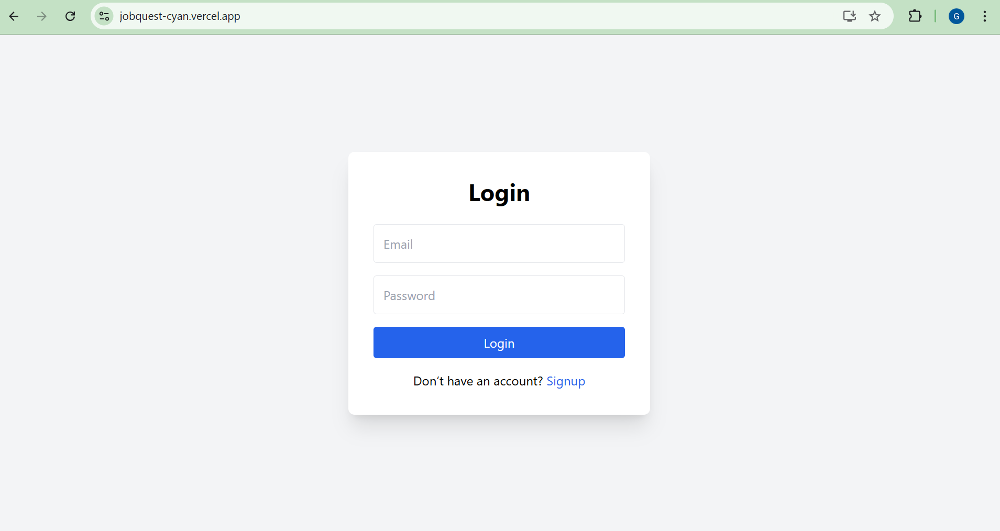
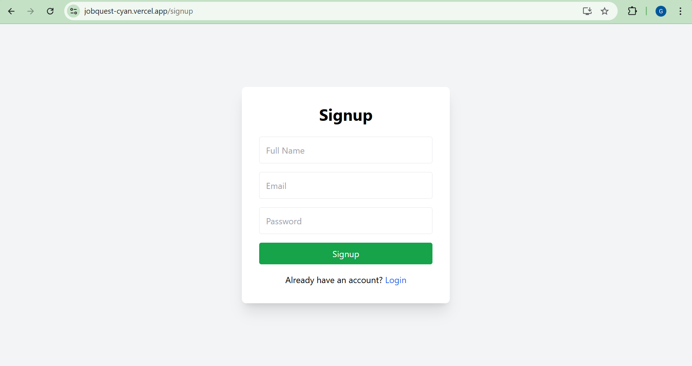
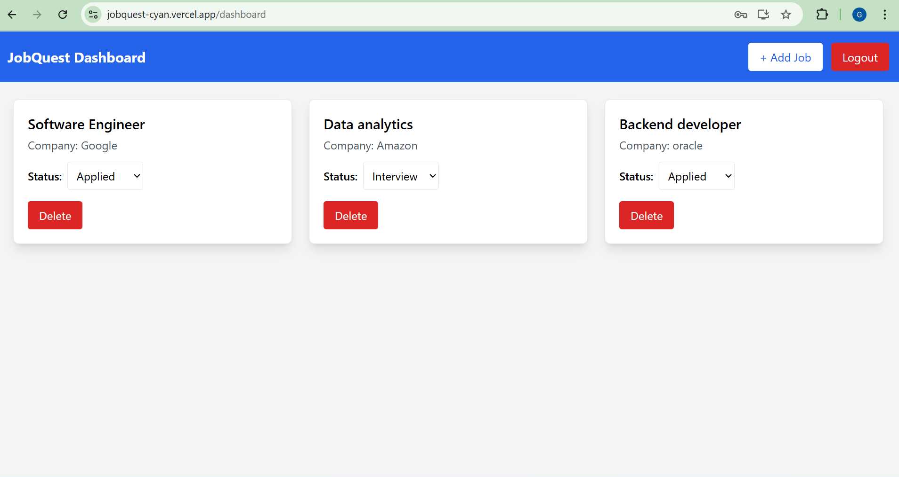
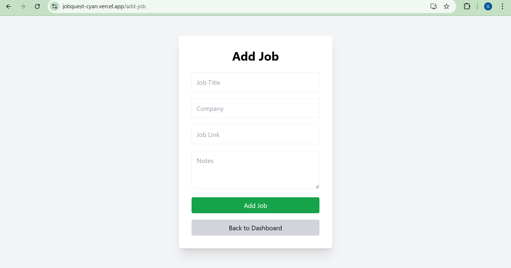

# JobQuest — Job Application Tracker (MERN Stack)

### 🚀 Live Links  
**Frontend (Vercel):** https://jobquest-cyan.vercel.app  
**Backend (Render):** https://jobquest-backend-umvj.onrender.com  

---

## 📌 Overview
JobQuest is a full-stack job application tracking system built using the **MERN stack**.  
It helps job seekers organize and manage:

- Job applications  
- Status updates  
- Company information  
- Notes  
- Daily job search tasks  

The system includes **JWT authentication**, **MongoDB cloud database**, and a **responsive Tailwind UI**.

---

## ⭐ Features

### 🔐 Authentication
- User Signup / Login  
- JWT-based secure authentication  
- Password hashing using bcrypt  

### 📄 Jobs Management
- Add job application  
- Update job status (Applied → Screening → Interview → Offer → Rejected)  
- Delete job  
- Attach company name, link & notes  

### ✔️ Task Management
- Add tasks  
- Mark tasks as complete  
- Delete tasks  

### 🎨 UI / UX
- Clean UI with Tailwind CSS  
- Responsive layout  
- Simple dashboards and forms  

### ☁️ Deployment
- Frontend deployed on **Vercel**  
- Backend deployed on **Render**  
- Connected using environment variables  

---

## 🏗️ Tech Stack
**Frontend:** React.js, Axios, Tailwind CSS  
**Backend:** Node.js, Express.js  
**Database:** MongoDB Atlas  
**Authentication:** JWT + bcrypt  
**Deployment:** Vercel (frontend), Render (backend)

---

## 📁 Folder Structure

```
jobquest/
│── client/        # React frontend
│── server/        # Node.js backend
│── README.md
│── .gitignore
```

---

## 📦 Installation (Local Development)

### Clone the repository
```
git clone https://github.com/gauravchaudhary724/jobquest.git
cd jobquest
```

### Install backend
```
cd server
npm install
npm start
```

### Install frontend
```
cd ../client
npm install
npm start
```

---

## 🛠️ Environment Variables

Create a **.env** file inside the `server` folder:

```
MONGO_URI=your_mongo_connection_string
JWT_SECRET=your_secret_key
PORT=5000
```

---

## 🗂️ API Endpoints

### Auth  
```
POST /api/auth/register
POST /api/auth/login
```

### Jobs  
```
POST /api/jobs
GET /api/jobs
DELETE /api/jobs/:id
```

### Tasks  
```
POST /api/tasks
GET /api/tasks
PUT /api/tasks/:id
DELETE /api/tasks/:id
```

---

## 🚀 Deployment

### Frontend (Vercel)
https://jobquest-cyan.vercel.app

### Backend (Render)
https://jobquest-backend-umvj.onrender.com
---

## 📸 Screenshots

### 🔐 Login Page


### 📝 Signup Page


### 📊 Dashboard


### ➕ Add Job Page


